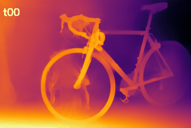

# Experiments in Improving Boosting Monocular Depth
Deep Learning 631 Project Recap

By Phil Navo and Kris Johnson

Based on the paper:
> Boosting Monocular Depth Estimation Models to High-Resolution via Content-Adaptive Multi-Resolution Merging, by
> S. Mahdi H. Miangoleh\*, Sebastian Dille\*, Long Mai, Sylvain Paris, Yağız Aksoy.
> [Main pdf](http://yaksoy.github.io/papers/CVPR21-HighResDepth.pdf),
> [Supplementary pdf](http://yaksoy.github.io/papers/CVPR21-HighResDepth-Supp.pdf),
> [Project Page](http://yaksoy.github.io/highresdepth/),
> [Github Repo](https://github.com/compphoto/BoostingMonocularDepth).

## TL;DR
Try the model easily in Colab : 

---
## Goals
For this assignment, we found a very cool paper and github repository which trains a model to blend low and high resolution depth maps and depth map patches to create scene consistent, higher quality depth maps. With that, we wanted to understand the paper and explain what the repository was actually doing, as well as experiment with model hyperparameters to see if we could get better results.

1. Better explain paper and repo
1. Experimenting on threshold values used to generate patches and how that effects visual results

---
## Methods Attempted
1. Understanding the Paper

For this assignment, we found a very cool paper that created impressive higher resolution depth maps than the existing state of the art, aka s.o.t.a., solutions. Those solutions like pretrained, fully convolutional, s.o.t.a [MiDaS-v2][1], will generate demonstrably different outputs for the same image at different input resolutions, which the authors claim is due to the receptive field size of CNNs and is easily visible in the following figure from the paper:

<figure class="image">
  
  <figcaption>Receptive Field Effects on Different Input Resolutions</figcaption>
</figure>

The paper performs a "double estimation method". The authors train a "Mergenet" to blend low and high resolution depth maps by training a 10 layer UNet as a Generator within the [pix2pix](https://github.com/phillipi/pix2pix) GAN architecutre. The low resolution outputs usefully capture scene consistency, so depth is consistent across the entire image. The high resolution inputs capture high frequency details and improved boundaries, so a small bird or tiny pipe will appear where the low resolution might've missed it.

The authors then supply low and high resolution full image inputs to MiDaS and merge them with their Mergenet. Using edges as a proxy for contextual cues, they determine the maximum resolution where every pixel has access to an edge within the MiDaS receptive field size and dub it $R_0$ for the low resolution image. The authors then determine the high resolution based off $R_{20}$, meaning a resolution where 20% of pixels aren't within a receptive field size of an edge. 

To further boost their output, authors splice out patches of the image with a density of high frequency detail. They tile the mergenet output, which is at $R_{20}$, based on the receptive field size and a 1/3 overlap to generate candidate patches. They discard patches with edge density less than the entire image and increase the size of accepted patches until they have identical edge density compared to the full mergenet output. Finally they layer the patches directly onto the mergenet output one by one.

### Experimenting with different patch size configs on pretrained model
The author's choice of 20% for the hyperparameter determining the high resolution value seemed ripe for investigation. We experimented with incremental values of 5 from 0 to 30, where 0 would be merging low resolution onto itself. With the patch based fine tuning, thresholds of 0 won't match the MiDaS output directly. Depth estimates can then be directly compared to the original data label provided in Middleburry.

---
## Issues
We were very excited that there was a github repo so we could experiment with such a cool technique. However we ran into many issues when trying to actually replicate and then expand upon the authors' work.

### Matlab everywhere
First and foremost among the issues we encountered was the use of matlab scripts, and having to go into those scripts to edit variables like `root_dir`. The [evalatedataset.m](./evaluation/evaluatedataset.m) script has 5 environment variables that need editing. Further, the images in the two folders supplied must have identical names.

[GNU Octave](https://www.gnu.org/software/octave/index) is often compatible with matlab, but support is often quoted as "experimental". The matlab code also requires third party packages, like [vlfeat](https://www.vlfeat.org/), which to use with Octave requires directly compiling with `MKOCTFILE=mkoctfile make`. Of course, to get `mkoctfile` requires `brew install llvm` and the list goes on. 

Needless to say, we weren't able to get `evaluatedataset.m` working.

### Seemingly easy repo, tons of complexity
The authors kindly provided a lengthy write up of instructions, which was much appreciated. However, the instructions were lengthy because there was a lot of complexity that perhaps could've been managed better. Pretrained weights need to be copied to multiple locations within the repo folder instead of just pointing at the same copy. Command line instructions are run from many different directories. The generate training data portion takes images extracted into a `/middleburry` folder with 3 subfolders and then generates a train test split inside of `/mergenetdataset` with four subfolders each, generating 11 folders, and at first it's not clear what images need to be put where and what folders to point the next step to.

The collab however worked well and was easily the best part of the repo. After adding `--rval` to the run.py argparse, generating different threshold outputs was easy. We did have issues though with the collab download links going offline for 30 minute windows at a time.

### No environment with GPU and Matlab together
Another major hurdle was shuffling data between environments. The training data is almost 2 gigs since the images are high resolution and the ground truth data is 32 bit. Generating 30+ patches per image also explodes the data size. Since we didn't have permissions to install Octave on the remote GPU cluster we had access to, we had to shuffle our local Octave outputs to the remote cluster and back multiple times to generate the training data. After a few hours I killed the `scp -C` to not hog resources, so we weren't able to fully generate the last step of training data.

---
## Outcomes

### Visual Reults
Here are three results from our experiments that show the differences in t-thresholds. They follow the general trend that at higher thresholds more details are visible while some of the scene consistency visually decreases. At lower resolutions the scene consistency, which you can think of as color smoothness on a given surface, is very strong but small details are often missing.

__Bike__

<figure class="image">
  
  
</figure>

At lower thresholds the rear tire blends in with the back wall, while higher thresholds it's visibly separate. At higher thresholds the details on the backpack become more visible.

__Pipes__

<figure class="image">
  
  
</figure>

Starting at t15 the smaller pipes in the background appear. 

__Adirondack__

<figure class="image">
  
  
</figure>

Higher thresholds bring out details for the scarf and the books.

### Repo Partial Cleanup
We created a [notebook](./Create_Training_Data.ipynb) that better showed how to create the training data, which consists of numerous steps bouncing back and forth between PyTorch on a GPU and Matlab. Because the training data images are high resolution, training data size gets up to 25 gigs. 

---
## Next Steps

1. Port Matlab code to Python. Especially evaluatedataset.m to actually be able to quantify quality improvements.
1. Experiment retraining the Mergenet with different threshold values.
1. Create video outputs to evaluate consistency over time. Running each frame takes 15-30 seconds, so generating outputs on videos will require a lot of compute time.

[1]: https://github.com/intel-isl/MiDaS/tree/v2